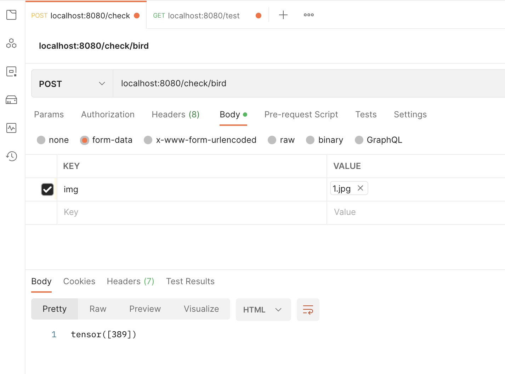

# Docker Compose

``` bash
docker compose up 

docker compose down --rmi local
```

PORT:

host 8080 < - > 3000 container



# K8s (w/ minikube)

``` bash
kubectl apply -f k8sDeployment.yml

# nodeJS container 30080
# python(w/ PyTorch) container 3000
# k8s expose 32649

minikube service nodejs-torch-service # minikube tunneling -- random PORT.

# HTTP POST -> 127.0.0.1:TUNNELING_PORT

kubectl delete deployment.apps nodejs-torch

kubectl delete service nodejs-torch-service 


```